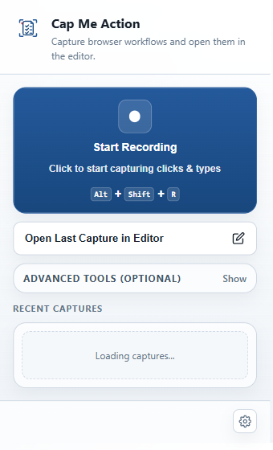
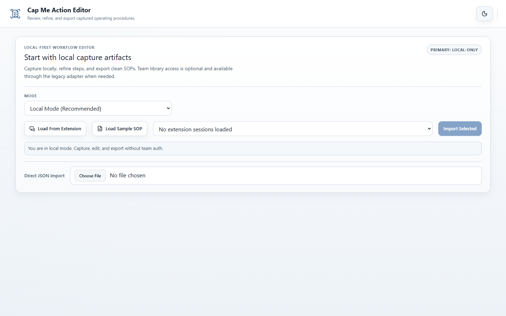
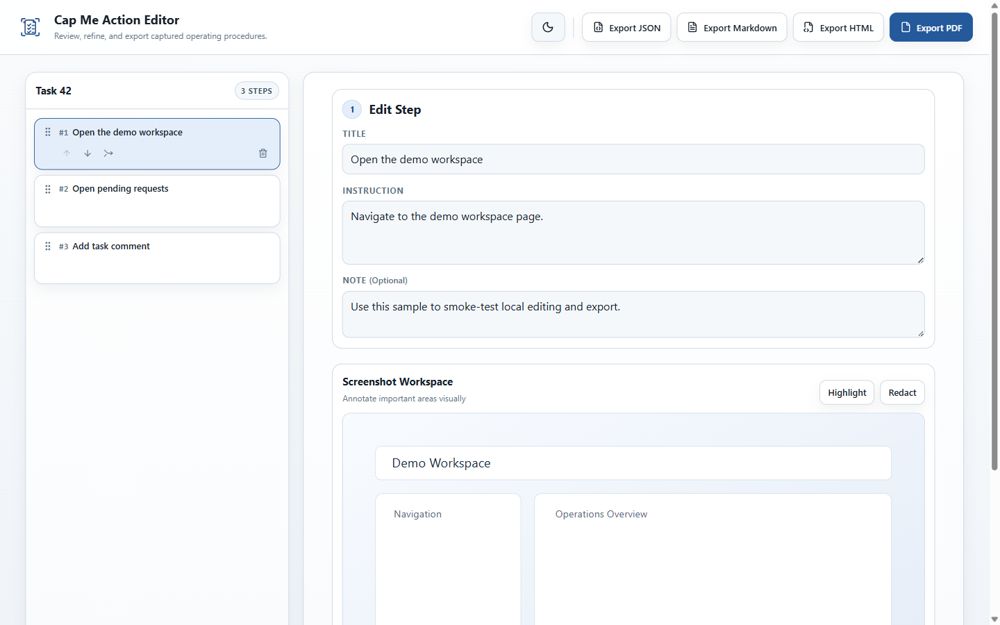

# Cap Me Action

Cap Me Action is a browser-based SOP capture and guide authoring tool.  
It records workflow steps from a Chrome extension, then lets you refine and export those steps in a web editor. The editor can also hand polished HTML plus matching JSON to n8n for storage and distribution.

## Project status

Active prototype with working local-first capture/edit/export flow and an n8n handoff for polished SOP artifacts.

## Who this is for

- Individuals who want to document repeatable browser workflows quickly.
- Small teams that need practical SOP capture/edit/export with low setup friction.

## Main workflow

1. Capture actions in the extension.
2. Open the captured session in the editor.
3. Refine steps, notes, screenshots, and annotations.
4. Export SOP artifacts (JSON, Markdown, HTML, PDF).
5. Send the polished JSON + HTML bundle to n8n for shared storage/distribution when needed.

## Architecture (current)

- `extension/`: Chrome MV3 capture client, dock, popup, inspector, local storage, editor handoff.
- `app/`: React/Vite local-only editor for import, editing, export, and n8n handoff.
- `backend/google-apps-script/team-library/`: legacy Team Library adapter backend source kept as a historical reference.

Primary product path is local-first.  
n8n now handles storage/distribution of polished SOP artifacts after export.  
Google Apps Script Team Library support is a legacy reference path, not the long-term default.

## What exists today

- MV3 extension capture with popup, inspector, and floating dock.
- Editor workflow for import, step editing, annotations/redactions, and export.
- Export controls for JSON, Markdown, HTML, and PDF.
- Local n8n webhook handoff that sends canonical JSON plus polished HTML.
- Contract-backed session payload schema and migration boundary.
- Versioned extension packaging and verification commands.

## Local-first run

1. Install dependencies:
```bash
pnpm install
```
2. Start the editor:
```bash
pnpm dev:app
```
3. Load unpacked extension from `extension/` in `chrome://extensions`.
4. Capture a short session and open it in the editor.

No `.env` variables are required for the basic local-first flow.

## Useful commands

- `pnpm build:app`
- `pnpm extension:check-syntax`
- `pnpm extension:package`
- `pnpm extension:verify-package`
- `pnpm extension:print-id`
- `pnpm extension:set-oauth-client-id -- --client-id "YOUR_CLIENT_ID.apps.googleusercontent.com"`
- `pnpm docs:bundle`
- `pnpm docs:check`

## Extension identity and OAuth setup note

- This public baseline does not commit `extension/manifest.json` `key`.
- That means extension ID is not pinned by default in the repo.
- `pnpm extension:print-id` now reports when ID cannot be derived from repo config.
- If you need a stable local extension ID, set a local key with:
  - `pnpm extension:set-oauth-client-id -- --key "<base64-der-public-key>"`

## Screenshots / demo media

### Extension popup



### Editor import surface



### Step editing workspace



### Export controls


## Current maturity and limits

- Project is functional for local capture/edit/export and n8n-assisted artifact storage/distribution, but still evolving.
- The editor is intentionally local-only in the primary UX.
- Team Library remains in the repo as a legacy Google Apps Script reference path, not the default product route.
- Browser-agnostic self-hosted team mode is not the current product focus.

## Technical references

- [Team Library protocol](TEAM_LIBRARY_PROTOCOL.md)
- [SOP package contract](docs/protocols/sop-package-contract.md)
- [Session export schema](docs/export-schema.json)

## License

Apache-2.0. See [LICENSE](LICENSE).
